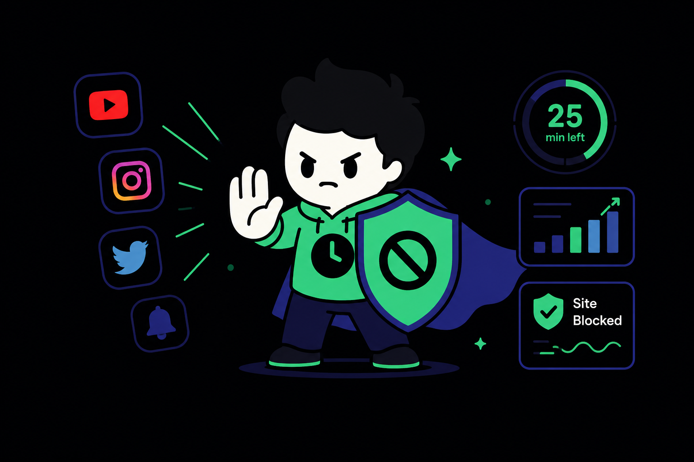
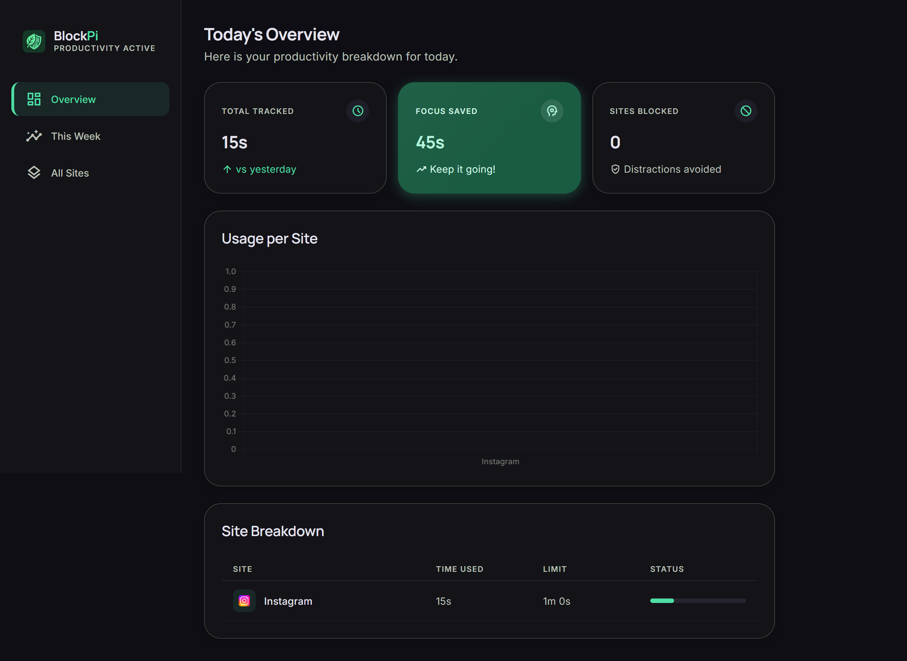
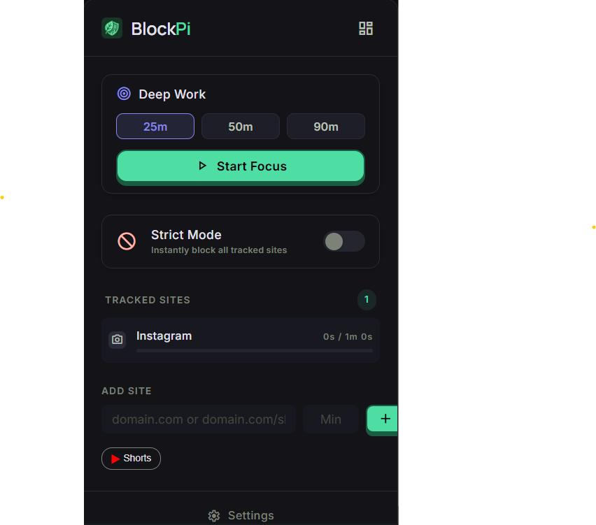

#  BlockPi — Stay focused. Browse better.

**BlockPi** is a lightweight, privacy-first browser extension designed to help you reclaim your focus. It allows you to set daily time limits for distracting websites, automatically blocking them once your time is up. No trackers, no servers, zero bloat.

---

## 🧐 The Problem & Our Solution

### The Issues We Face
1. **The Attention Economy:** Modern websites are engineered to keep you scrolling. A "quick 5-minute check" on YouTube or Twitter often turns into an hour of lost productivity.
2. **Privacy Trade-offs:** Most focus tools and blockers track your browsing habits, sell your data, or require account creation just to save a few settings.
3. **Performance Bloat:** Many extensions use heavy frameworks that slow down your browser, ironically making you less productive.

### How BlockPi Fixes Them
- **🎯 Intentional Browsing:** Instead of total bans, BlockPi lets you set **granular daily budgets**. You can enjoy your favorite sites in moderation, and when the budget hits zero, BlockPi steps in.
- **🛡️ 100% Local Privacy:** We have **zero servers**. Every timer, every tracked site, and every analytic data point is stored strictly on your machine using `chrome.storage.local`. 
- **⚡ Vanilla JS Architecture:** Built with pure JavaScript (no React/Vue/Angular), BlockPi has a near-zero memory footprint. It’s fast, invisible, and stays out of your way until it’s needed.

---

## ⚡ Core Features

  

- **🛡️ The Guardian (Smart Blocking):** Set per-website daily limits (e.g., YouTube = 30 min/day). BlockPi enforces these limits so you don't have to.
- **📊 The Analyzer (Visual Insights):** Track your progress with high-precision charts. See exactly where your time goes.
- **⚡ The Speedster (Zero Bloat):** Written in pure Vanilla JS. Near-zero CPU and memory impact.
- **🔒 Privacy First:** 100% local storage. Your browsing data never leaves your machine.

---

## 🖼️ Inside BlockPi

| **Visual Dashboard** | **Quick Control Popup** |
|:---:|:---:|
|  |  |
| *Track daily & weekly trends* | *Instant timers & one-click blocking* |

---

## 🚀 Installation

BlockPi is currently in developer preview. Follow these simple steps to load it into your browser:

1.  **Download & Extract:** [Download the BlockPi.zip](BlockPi.zip) and extract it to a folder on your computer.
2.  **Extensions Page:** Open your browser and navigate to `chrome://extensions`.
3.  **Developer Mode:** Toggle the **Developer mode** switch in the top right corner.
4.  **Load Unpacked:** Click the **Load unpacked** button and select the folder where you extracted BlockPi.

---

## 🛠️ Tech Stack

Built for speed and privacy using modern web standards:

- **Runtime:** Pure Vanilla JavaScript (ES2022) - *Zero framework overhead*
- **Manifest:** Chrome Extension Manifest V3 - *Safe & Future-proof*
- **Background:** Service Workers - *Sleeps when idle to save CPU*
- **Storage:** `chrome.storage.local` - *Fast, local-first data*
- **Analytics:** [Chart.js](https://www.chartjs.org/) - *Loaded lazily on demand*
- **Theme:** Dark Neobrutalism (Primary: `#4ade80`, Accent: `#818cf8`)

---

## 🤝 Contributing

BlockPi is an open-source project. We welcome contributions!
1. Fork the Project
2. Create your Feature Branch (`git checkout -b feature/AmazingFeature`)
3. Commit your Changes (`git commit -m 'Add some AmazingFeature'`)
4. Push to the Branch (`git push origin feature/AmazingFeature`)
5. Open a Pull Request

---

## 📜 License

Distributed under the MIT License. See `LICENSE` for more information.

---

  Built with ❤️ for a more focused web.

